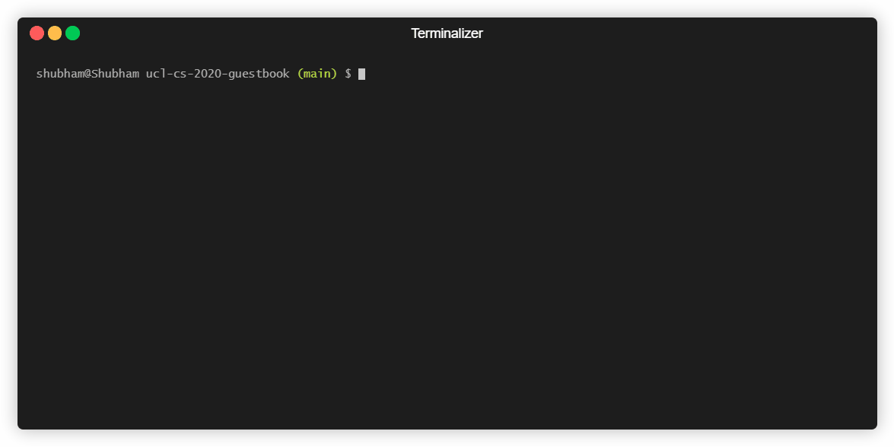
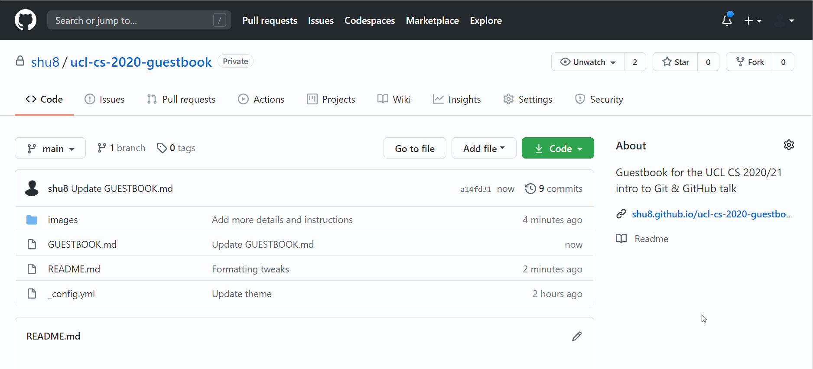

# Welcome to CS @ UCL!

## [Skip to the Guestbook](./GUESTBOOK.md)

If you've reached this repository, well done - you've reached the end of my Intro to Git & GitHub talk!

### Reminders

Here are a few reminders from the talk:

- Git is a time machine (kind-of)
  - you can _go back in time_
  - you can _rewrite history_
  - you can _collaborate with others on code_
- projects are split into _repositories_
- you make a _commit_ to make a 'checkpoint' of your code
- GitHub is a website that lets you manage and host your Git repositories, and provides a pretty UI to do so (it also has a bunch of features to help make it easier to work with others on projects!)

**Remember to register for the [GitHub Student Developer Pack](https://education.github.com/pack) for a bunch of free perks!**.

### Your challenge

Use GitHub's interface, GitHub Desktop, or the Git CLI (terminal!) to edit the [**GUESTBOOK.md**](./GUESTBOOK.md) file and add your name (or username!) and a short fact(s) about yourself so we can get to know each other!

If you want to add a link to a personal website, or social media, or even a picture of yourself, feel free to do so too!

> Remember: **everything** in a public repository (like this!) can be **seen by the entire world** -- make sure you add a fact you are happy with anyone knowing and are happy with it being linked to your GitHub profile!

Here's an example of the [Markdown](https://guides.github.com/features/mastering-markdown/)-formatted text you can add to the file:

```md
### Shubham Jain
I loooveeeeee the [Chuck](https://www.nbc.com/chuck) TV series

### Prithvi Kohli
I make games!! here's my [twitter](https://twitter.com/PrithviKGames)
```

### Instructions

If you can't remember, these are the steps you'll need to take to add your name to the Guestbook:

1. Go to the repository on GitHub at <https://github.com/shu8/ucl-cs-2020-guestbook>

2. Fork the repository using the "fork" button at the top right of the repo, or using this URL: <https://github.com/shu8/ucl-cs-2020-guestbook/fork>

3. Clone the forked repository (**only needed if you are using the command line**):

   ```bash
   git clone https://github.com/YOUR-USERNAME/ucl-cs-2020-guestbook
   ```

4. If you're:

    - **using the command line**: make your changes using your favourite text editor
    - **using the GitHub interface**: find the `GUESTBOOK.md` file in the list of files (<https://github.com/YOUR-USERNAME/ucl-cs-2020-guestbook/blob/main/GUESTBOOK.md>), click the pencil "edit" icon at the top right of the file, and make your changes

5. If you're:

    - **using the command line**: stage your files, and commit them: `git add GUESTBOOK.md` followed by `git commit -m "Add YOUR-NAME"`
    - **using the GitHub interface**: add a short commit message at the bottom of the edit page, and press "Commit changes". This will also automatically push your changes

6. If you're using the command line, you'll need to push your changes: `git push origin main`.

7. Make your pull request! Go to <https://github.com/shu8/ucl-cs-2020-guestbook/compare> and choose "compare across forks", find your forked repo, and submit! One of the Senior Programming Tutors (myself, Shirin, Brian, or Ethan) will accept your Pull Request as soon as possible!

You can find the final Guestbook as a webpage at <https://shu8.github.io/ucl-cs-2020-guestbook/GUESTBOOK.html>!

### Demos

If you're using the command line:



If you're using the GitHub interface:



### Where to get help

If you're having any problems following these steps, feel free to **make an issue** at <https://github.com/shu8/ucl-cs-2020-guestbook/issues/new> -- this will let any one of the Senior Programming Tutors see your issue and reply to you as soon as possible!
